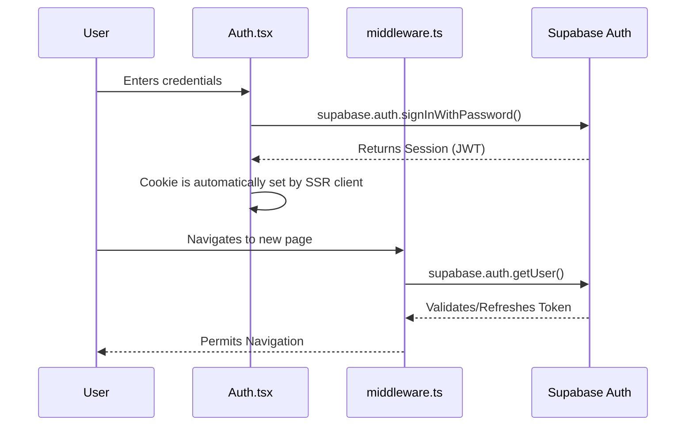
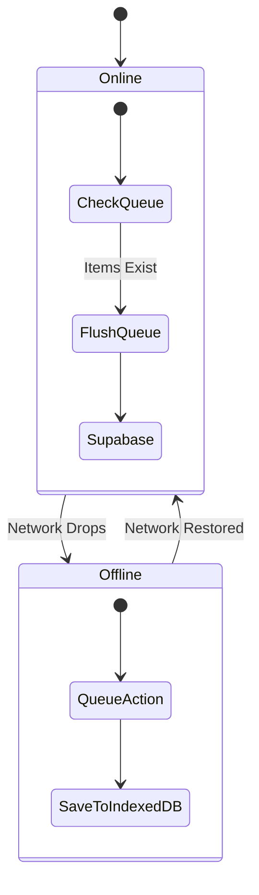

# Architecture Document: Rural Healthcare Platform

This document details the software architecture, design patterns, and structural choices for the Rural Healthcare Platform. It is written to serve as an in-depth guide for new engineers joining the project.

---

## 1. Overall Architecture

The platform employs a **Backend-For-Frontend (BFF)** Serverless architecture. 
- **Next.js** acts as the full-stack framework handling the UI, API routing, and server-side rendering.
- **Supabase** acts as the managed Backend-as-a-Service (BaaS) handling authentication, relational data, spatial queries, and file storage.

---

## 2. Frontend Architecture

The frontend is built using **React 18** and **Next.js 15.2**, optimized for low-bandwidth environments.

### Component Design Pattern
The application follows a "Fat Component" design within a Single Page Application (SPA) container. 
- Components (e.g., `Dashboard.tsx`, `SymptomChecker.tsx`) handle both their own UI presentation and their own data-fetching logic (`useEffect`).
- Styling is completely utility-first using **Tailwind CSS**, supplemented by **shadcn/ui** for complex accessible primitives (dialogs, select menus, avatars).

### Routing (Native App Router)
**Critically important for new developers:** The application was recently migrated to utilize native Next.js file-based routing (`app/(dashboard)/...`, `app/directory/page.tsx`, etc.). 

- Navigation is handled client-side using `useRouter().push('/path')` from `next/navigation`.
- Global UI elements (Header, Footer) and state (`AppProvider`) persist across navigations because they are wrapped in the root `app/layout.tsx`.

### State Management
- **Global State:** Passed down via Prop Drilling from `app/page.tsx` to child components. The primary global states are:
  - `user`: The authenticated Supabase user profile.
  - `language`: `en` or `hi` (English/Hindi toggle).
  - `setCurrentPage`: The navigation dispatcher.
- **Local State:** Managed via `useState` and `useReducer` within individual components.

---

## 3. Backend Architecture

The backend logic is split between **Next.js API Routes (Serverless Functions)** and **Supabase (PostgreSQL)**.

### API Layer (`/app/api/`)
API Routes serve as a secure middleman between the client and the database or external APIs. 
- **Security:** API keys (like `GEMINI_API_KEY` or `SUPABASE_SERVICE_ROLE_KEY`) are kept strictly in the server environment and never exposed to the client.
- **Validation:** Every API route implements rigorous schema validation using **Zod**. If a client payload fails validation, the route immediately returns a `400 Bad Request`.

### Database (PostgreSQL + PostGIS)
All persistent state lives in Supabase.
- **Relational Data:** Tables for `patients`, `appointments`, and `medical_records`.
- **Spatial Data:** The `healthcare_facilities` table uses **PostGIS**. Facility locations are stored as `geography(Point, 4326)`.
- **Row Level Security (RLS):** Supabase enforces security at the database row level. E.g., A patient can only `SELECT` records where `patient_id = auth.uid()`.

---

## 4. Authentication Flow

Authentication is handled via **Supabase SSR (Server-Side Rendering) Auth**, which uses secure HttpOnly cookies rather than LocalStorage for JWT management.

### Components Involved:
- `components/Authentication.tsx` - The UI for login, register, and guest access.
- `lib/supabase/middleware.ts` - Refreshes auth tokens on navigation.
- `lib/supabase/client.ts` - Creates the browser client.

---

## 5. Services & Integrations

### Gemini AI (`/api/symptom-analyze`, `/api/ai-chat`)
- Used for clinical triaging and user assistance.
- **Implementation:** Prompts are heavily engineered and constrained. We parse structured responses from the LLM and fall back to hardcoded safety checks if the LLM hallucination threshold is breached.

### Jitsi WebRTC (`components/JitsiMeeting.tsx`)
- Used for low-bandwidth video teleconsultations.
- **Implementation:** We load the Jitsi external script dynamically and embed an iframe linked to a unique `teleconsult_room_id` stored in the `appointments` table.

### Map & Spatial (Leaflet + PostGIS)
- **Implementation:** The client uses `react-leaflet` to render OpenStreetMap tiles. It requests `/api/facilities/nearby?lat=X&lng=Y`, which executes a highly optimized PostGIS RPC function `nearby_facilities()` on Supabase.

### 5.4 Rate Limiting
To prevent abuse, all Next.js API routes implement rate limiting via `@upstash/ratelimit`. This leverages an Upstash Redis database (`UPSTASH_REDIS_REST_URL`) to globally synchronize token-bucket counts across distributed serverless functions. If the Redis keys are missing locally, it safely falls back to a Node.js `Map`-based memory cache.

---

## 6. Offline Data & Sync Queue

Designed to handle unreliable rural networks.

- **Files Involved:** `lib/offline/storage.ts`, `lib/offline/sync.ts`.
- **Current Status:** Partially implemented (queues POST requests like health vitals).

---

## 7. Reusable Components (`/components/ui/`)

We utilize the **shadcn/ui** ecosystem. These are not npm packages, but raw React components placed in the `ui/` directory that utilize `Radix UI` for accessibility and `Tailwind CSS` for styling.
- `Button.tsx`, `Input.tsx`, `Card.tsx`, `Tabs.tsx`, `Badge.tsx`.
- **Styling Utility:** `lib/utils.ts` contains the `cn()` function which merges Tailwind classes dynamically using `clsx` and `tailwind-merge`.

---

## 8. Middleware

The file `middleware.ts` located at the project root executes before a request completes.
- **Purpose:** Exclusively handles Supabase Auth session refresh. It ensures that if a user's JWT expires, it is silently refreshed in the background without forcing them to log in again.
- **Execution:** It runs on the Edge runtime for maximum speed.

---

## 9. Detailed Folder Responsibilities

| Directory/File | Responsibility |
|----------------|----------------|
| `app/api/` | Next.js API Routes (Server logic, Zod parsing, Supabase Server client). |
| `app/page.tsx` | The Master SPA Router. Mounts all components and manages global state. |
| `components/` | Domain-specific components (e.g., `Dashboard.tsx`, `SymptomChecker.tsx`). |
| `components/ui/` | Generic, reusable UI primitives (shadcn). |
| `lib/supabase/` | Supabase initialization clients (browser, server, middleware). |
| `lib/offline/` | IndexedDB management for spotty network queueing. |
| `scripts/` | Database seeders and PostGIS SQL migration scripts. |
| `hooks/` | Custom React hooks (e.g., `use-mobile.tsx`, `use-toast.ts`). |
| `.agents/AGENTS.md` | Persistent rules guiding AI agent behavior in this repository. |
