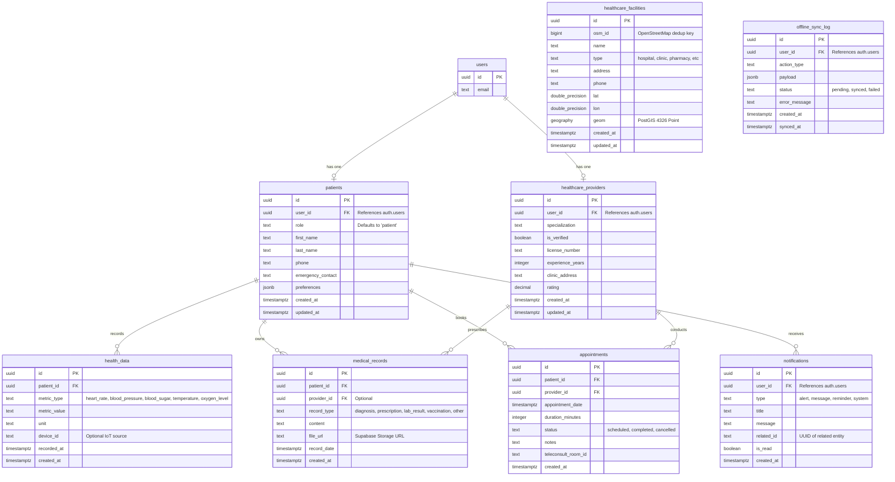

# Database Reference: Rural Healthcare Platform

This document describes the schema, structure, relationships, and advanced database features powering the Rural Healthcare Platform via **Supabase (PostgreSQL + PostGIS)**.

---

## 1. ER Diagram



---

## 2. Core Tables & Constraints

### 2.1 `patients`
- **Purpose:** Core patient profile extending the base `auth.users` table.
- **Constraints:** 
  - `user_id` MUST be UNIQUE (1:1 relationship with Auth).
  - Deleting the `auth.users` row cascades here.

### 2.2 `healthcare_providers`
- **Purpose:** Doctor/clinician profiles.
- **Constraints:**
  - `user_id` MUST be UNIQUE.
  - `is_verified` defaults to `false` and must be manually/admin toggled before they appear in public directories.

### 2.3 `appointments`
- **Purpose:** Scheduling and Jitsi room tracking.
- **Constraints:**
  - Validates `status` against predefined strings.
  - Automatically generates a `teleconsult_room_id` upon insertion via Trigger.

### 2.4 `healthcare_facilities`
- **Purpose:** Directory of physical locations sourced from OSM.
- **Features:** 
  - Uses the **PostGIS** extension.
  - `geom` column is automatically populated by a trigger whenever `lat` and `lon` are inserted.
- **Constraints:**
  - `osm_id` is UNIQUE to prevent duplicate imports.

---

## 3. Indexes

To maintain performance on read-heavy or spatial queries, the following indexes are actively enforced:
- **Foreign Keys:** `idx_appointments_patient_id`, `idx_health_data_patient_id`
- **PostGIS:** `idx_facilities_geom` using a **GIST** index on `healthcare_facilities(geom)` for fast radial bounding-box queries.
- **Filters:** B-Tree index on `healthcare_facilities(type)` and `appointments(status)`.

---

## 4. Migrations & Seed Scripts

Database schema changes are tracked in the `supabase/` directory and must be executed in the Supabase SQL Editor in sequential order.

| File | Purpose |
|--------|---------|
| `01_schema.sql` | Core table definitions, foreign keys, and PostGIS extension setup. |
| `02_functions_triggers.sql` | DB helper functions (`get_user_role`, `handle_new_user`, `nearby_facilities`), auth trigger, and PostGIS geom auto-population trigger. |
| `03_rls.sql` | **Complete** Row-Level Security policies for every table (all roles, all operations). |
| `04_seed_data.sql` | Real-world Madhya Pradesh health facilities, demo providers, and sample medical records. |
| `05_security_patch.sql` | Enables RLS on tables that were missing it (`doctor_requests`, `offline_sync_log`, etc.) and locks the `medical-records` storage bucket. |
| `06_security_warnings_final.sql` | Resolves all Supabase Security Advisor warnings: locks `search_path` on all functions, revokes `EXECUTE` from `anon`/`authenticated` on `SECURITY DEFINER` functions, drops over-permissive policy. |

---

## 5. Row Level Security (RLS) & Data Flow

**Security Rule:** NO direct database queries bypass RLS on the client side. All client Supabase calls use the user's session cookie and are subject to RLS. Only the `lib/supabase/admin.ts` service-role client (used exclusively in trusted API routes) bypasses RLS.

| Table | Patient Access | Doctor Access | Admin Access |
|---|---|---|---|
| `patients` | Own row (SELECT, UPDATE) | All rows (SELECT) | All rows (SELECT) |
| `medical_records` | Own records (all ops) | All records (SELECT, INSERT, UPDATE) | All records (all ops) |
| `appointments` | Own (all ops) | All (SELECT) | All (SELECT) |
| `health_data` | Own (all ops) | All (SELECT) | All (SELECT) |
| `notifications` | Own + broadcast (SELECT, UPDATE read) | — | All (all ops) |
| `camps` | Public (SELECT) | Public (SELECT) | All (all ops) |
| `healthcare_facilities` | Public (SELECT) | Public (SELECT) | All (all ops) |
| `doctor_requests` | Own request (SELECT, INSERT) | — | All (all ops) |
| `providers` | Own profile (SELECT, UPDATE, INSERT) | — | All (SELECT) |
| `offline_sync_log` | Own logs (SELECT, INSERT, DELETE) | — | — |

**Data Flow Example (Health Vitals):**
1. Next.js API `/api/health-data` validates the POST body with a **Zod schema** and runs rate limiting.
2. The route calls `createClient()` using the user's secure session cookie.
3. The SQL `INSERT` is executed against Supabase.
4. PostgreSQL RLS intercepts at the DB level, verifying `patient_id` matches the authenticated user's token context before committing.

---

## 6. Common Queries

### 6.1 Finding Nearby Facilities (PostGIS RPC)
This is executed via Supabase RPC (`supabase.rpc('nearby_facilities')`).
```sql
SELECT
  id, name, type, lat, lon,
  round((ST_Distance(geom, ST_SetSRID(ST_MakePoint(p_lon, p_lat), 4326)::geography) / 1000)::numeric, 1) AS distance_km
FROM healthcare_facilities
WHERE ST_DWithin(geom, ST_SetSRID(ST_MakePoint(p_lon, p_lat), 4326)::geography, p_radius_km * 1000)
ORDER BY distance_km LIMIT 200;
```

### 6.2 Fetching Patient Timeline
```sql
SELECT * FROM medical_records 
WHERE patient_id = 'uuid-here' 
ORDER BY record_date DESC;
```

---

## 7. Future Improvements

- **Database Triggers for Notifications:** Move the creation of `notifications` for upcoming appointments directly into a pg_cron scheduled job or an `AFTER INSERT` trigger on `appointments`.
- **Soft Deletes:** Implement `deleted_at` columns on medical records to prevent accidental permanent data loss.
- **Partitioning:** If `health_data` (IoT vitals tracking) scales heavily, partition the table by `recorded_at` date ranges to maintain index performance.
