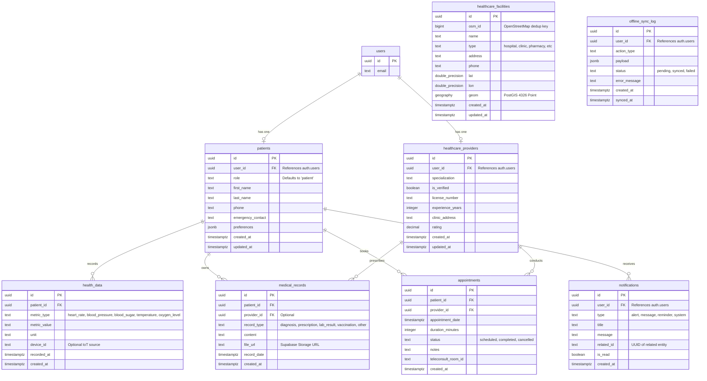

# Database Reference: Rural Healthcare Platform

This document describes the schema, structure, relationships, and advanced database features powering the Rural Healthcare Platform via **Supabase (PostgreSQL + PostGIS)**.

---

## 1. ER Diagram



---

## 2. Core Tables & Constraints

### 2.1 `patients`
- **Purpose:** Core patient profile extending the base `auth.users` table.
- **Constraints:** 
  - `user_id` MUST be UNIQUE (1:1 relationship with Auth).
  - Deleting the `auth.users` row cascades here.

### 2.2 `healthcare_providers`
- **Purpose:** Doctor/clinician profiles.
- **Constraints:**
  - `user_id` MUST be UNIQUE.
  - `is_verified` defaults to `false` and must be manually/admin toggled before they appear in public directories.

### 2.3 `appointments`
- **Purpose:** Scheduling and Jitsi room tracking.
- **Constraints:**
  - Validates `status` against predefined strings.
  - Automatically generates a `teleconsult_room_id` upon insertion via Trigger.

### 2.4 `healthcare_facilities`
- **Purpose:** Directory of physical locations sourced from OSM.
- **Features:** 
  - Uses the **PostGIS** extension.
  - `geom` column is automatically populated by a trigger whenever `lat` and `lon` are inserted.
- **Constraints:**
  - `osm_id` is UNIQUE to prevent duplicate imports.

---

## 3. Indexes

To maintain performance on read-heavy or spatial queries, the following indexes are actively enforced:
- **Foreign Keys:** `idx_appointments_patient_id`, `idx_health_data_patient_id`
- **PostGIS:** `idx_facilities_geom` using a **GIST** index on `healthcare_facilities(geom)` for fast radial bounding-box queries.
- **Filters:** B-Tree index on `healthcare_facilities(type)` and `appointments(status)`.

---

## 4. Migrations & Seed Scripts

Database schema changes are tracked in `scripts/` and must be executed in the Supabase SQL Editor.

| Script | Purpose |
|--------|---------|
| `001_create_tables.sql` | Base schema, tables, and foreign keys. |
| `002_rls_policies.sql` | Row-Level Security defining who can read/write what. |
| `003_functions.sql` | Utility functions. |
| `004_triggers.sql` | Auto-updating timestamps and room generation. |
| `005_indexes.sql` | Performance indexing. |
| `006_facilities_postgis.sql` | PostGIS setup, spatial RPC function `nearby_facilities`. |
| `007_security_hardening.sql` | Patches for auth checking in offline tables. |
| `seed_mp_facilities.js` | Node.js script to hydrate `healthcare_facilities` with raw GeoJSON. |

---

## 5. Row Level Security (RLS) & Data Flow

**Security Rule:** NO direct database queries bypass RLS on the client. 

1. **Patients:** Can strictly `SELECT`, `INSERT`, `UPDATE` rows where `user_id = auth.uid()` or `patient_id = <their_patient_uuid>`.
2. **Providers:** Can view appointments where `provider_id = <their_provider_uuid>`.
3. **Public Data:** `healthcare_facilities` and verified `healthcare_providers` are readable by the public (Guest mode allowed).

**Data Flow Example (Health Vitals):**
1. Next.js API `/api/health-data` validates the POST request.
2. The Server uses `createClient()` utilizing the user's secure Cookie.
3. The SQL `INSERT` is executed.
4. RLS intercepts at the database level ensuring `patient_id` matches the token context.

---

## 6. Common Queries

### 6.1 Finding Nearby Facilities (PostGIS RPC)
This is executed via Supabase RPC (`supabase.rpc('nearby_facilities')`).
```sql
SELECT
  id, name, type, lat, lon,
  round((ST_Distance(geom, ST_SetSRID(ST_MakePoint(p_lon, p_lat), 4326)::geography) / 1000)::numeric, 1) AS distance_km
FROM healthcare_facilities
WHERE ST_DWithin(geom, ST_SetSRID(ST_MakePoint(p_lon, p_lat), 4326)::geography, p_radius_km * 1000)
ORDER BY distance_km LIMIT 200;
```

### 6.2 Fetching Patient Timeline
```sql
SELECT * FROM medical_records 
WHERE patient_id = 'uuid-here' 
ORDER BY record_date DESC;
```

---

## 7. Future Improvements

- **Database Triggers for Notifications:** Move the creation of `notifications` for upcoming appointments directly into a pg_cron scheduled job or an `AFTER INSERT` trigger on `appointments`.
- **Soft Deletes:** Implement `deleted_at` columns on medical records to prevent accidental permanent data loss.
- **Partitioning:** If `health_data` (IoT vitals tracking) scales heavily, partition the table by `recorded_at` date ranges to maintain index performance.
