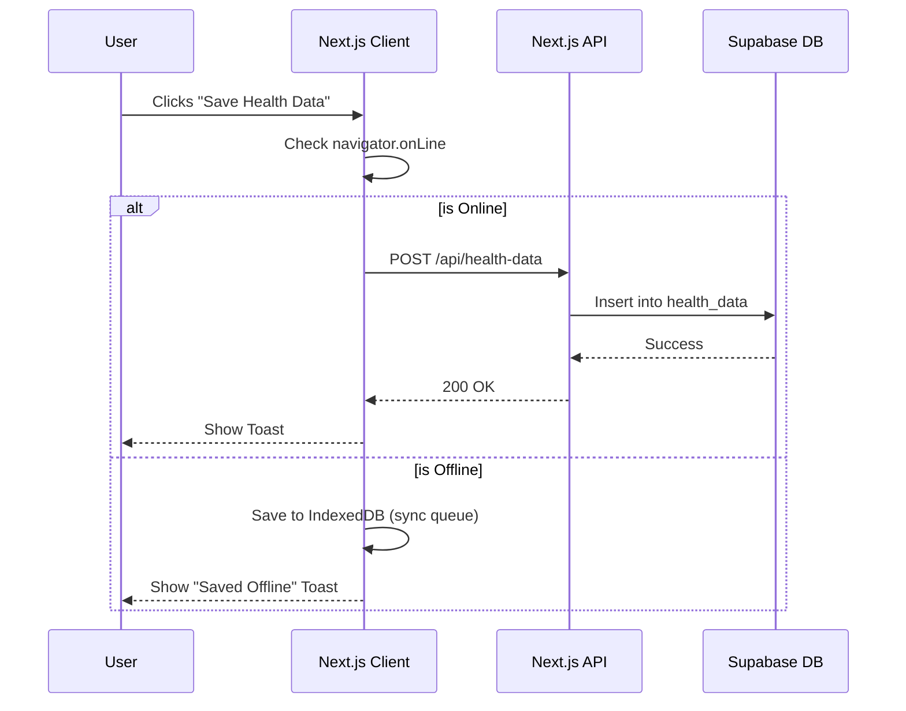
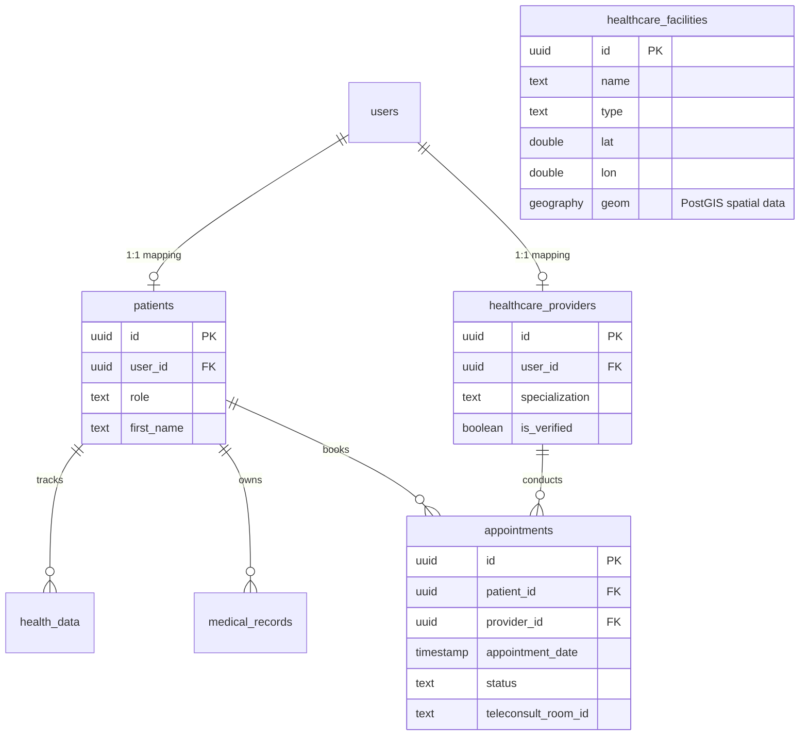

# Project Context: Rural Healthcare Platform

This document serves as the master source of truth for the Rural Healthcare Platform repository. It provides comprehensive technical and architectural documentation designed to onboard new developers and maintain technical alignment.

---

## 1. Project Overview

### Vision
To democratize healthcare access for rural populations by providing a unified, low-bandwidth digital platform that bridges the physical gap between patients and healthcare providers through AI, telemedicine, and localized data.

### Problem Statement
Rural communities, particularly in regions like Madhya Pradesh, face severe shortages of accessible healthcare facilities and specialized doctors. Patients often lack medical records, travel long distances for basic consultations, and struggle with health literacy. Existing digital solutions fail due to language barriers, complex UI, and offline connectivity issues.

### Target Users
1. **Patients:** Rural residents with basic smartphones, low bandwidth, and primarily Hindi-speaking. 
2. **Healthcare Providers:** Doctors, clinicians, and health workers providing remote or local care.

### Goals
- Enable AI-assisted primary symptom checking before human intervention.
- Facilitate low-bandwidth teleconsultations.
- Provide a localized, map-based directory of verified healthcare facilities.
- Digitize patient medical records seamlessly.
- Ensure the platform works in inconsistent network environments (offline-first capabilities).

### Scope
- **In-Scope:** Patient/Provider onboarding, AI symptom analysis, teleconsultation scheduling and video rooms, medical records storage, facility mapping via PostGIS, offline data queuing.
- **Out-of-Scope:** Payment gateways (free platform), hardware integrations (IoT wearables).

---

## 2. Technology Stack

### Frontend & Core Framework
- **[Next.js 15.2](https://nextjs.org/):** React framework using the App Router. Provides Server Components and API Routes for a seamless full-stack experience.
- **[React 18.3](https://react.dev/):** UI library.
- **[TypeScript](https://www.typescriptlang.org/):** Strict static typing across the entire codebase.

### Styling & UI Components
- **[Tailwind CSS 3.4](https://tailwindcss.com/):** Utility-first styling.
- **[shadcn/ui](https://ui.shadcn.com/):** Unstyled, accessible component primitives (Radix UI under the hood).
- **[Lucide React](https://lucide.dev/):** Iconography.

### Backend & Database
- **[Supabase](https://supabase.com/):** Open-source Firebase alternative providing PostgreSQL, Auth, and Storage.
- **[PostgreSQL + PostGIS](https://postgis.net/):** Relational database with spatial extensions for geographical mapping of health facilities.
- **[@supabase/ssr](https://supabase.com/docs/guides/auth/server-side/nextjs):** Secure, SSR-compatible cookie management for authentication.

### Specialized Services
- **[Google Gemini AI](https://deepmind.google/technologies/gemini/):** LLM integration for conversational AI Chat and automated Symptom Analysis.
- **[Jitsi Meet](https://jitsi.org/):** Open-source, WebRTC-based video conferencing embedded for teleconsultations.
- **[Leaflet / React-Leaflet](https://react-leaflet.js.org/):** Interactive, open-source mapping for the facility directory using OpenStreetMap tiles.
- **[Zod](https://zod.dev/):** Schema validation for API request bodies and query parameters.

---

## 3. High-Level Architecture

The platform follows a modern Serverless architecture where Next.js acts as the BFF (Backend-For-Frontend) and Supabase acts as the persistence and authentication layer.


---

## 4. Folder Structure

The repository follows a standard Next.js App Router structure with customized domain groupings.

```text
RURAL-HEALTHCARE-PLATFORM/
├── app/                  # Next.js App Router (Pages, Layouts, API Routes)
│   ├── api/              # Serverless API endpoints (Auth, AI, Facilities, Records)
│   └── globals.css       # Global Tailwind and CSS variable definitions
├── components/           # React Components (UI, Pages, Layout)
│   └── ui/               # shadcn/ui generic primitives (Buttons, Cards, Dialogs)
├── hooks/                # Custom React Hooks (Toast, Mobile detection)
├── lib/                  # Shared utilities and core integrations
│   ├── jitsi/            # Teleconsultation configurations
│   ├── offline/          # IndexedDB storage and sync queues
│   ├── supabase/         # Client, Server, Admin, and Middleware Supabase instances
│   └── rate-limit.ts     # In-memory API rate limiting logic
├── public/               # Static assets (Favicons, Hero images, Placeholders)
├── scripts/              # Database migration SQL and Data Seeder scripts
└── docs/                 # Project documentation
```

---

## 5. Feature Inventory

### 5.1 Authentication
- **Purpose:** Secure access and differentiate between Patient and Provider roles.
- **Current Status:** Implemented.
- **Implementation:** Email/Password, Google OAuth, and Guest mode via Supabase Auth.
- **Files Involved:** `components/Authentication.tsx`, `app/api/auth/*`

### 5.2 Interactive Dashboard (SPA Router)
- **Purpose:** Serve as the unified entry point without full page reloads.
- **Current Status:** Implemented.
- **Implementation:** State-based view rendering (`currentPage`) within `app/page.tsx`.
- **Files Involved:** `app/page.tsx`, `components/Dashboard.tsx`, `components/LandingPage.tsx`

### 5.3 Symptom Checker (AI)
- **Purpose:** Triage patients before booking consultations.
- **Current Status:** Implemented.
- **Implementation:** Multi-step wizard collecting body part and symptoms, sent to Gemini AI for probabilistic diagnosis. Includes a rule-based fallback if the AI fails.
- **Files Involved:** `components/SymptomChecker.tsx`, `app/api/symptom-analyze/route.ts`

### 5.4 Facility Mapping (GIS)
- **Purpose:** Locate nearest hospitals, clinics, and pharmacies.
- **Current Status:** Implemented.
- **Implementation:** PostGIS spatial queries calculating distance between user's browser geolocation and real OpenStreetMap facility data. Rendered via Leaflet.
- **Files Involved:** `components/MapView.tsx`, `app/api/facilities/nearby/route.ts`, `scripts/006_facilities_postgis.sql`

### 5.5 Teleconsultation
- **Purpose:** Remote doctor visits.
- **Current Status:** Implemented.
- **Implementation:** Dynamic Jitsi room generation tied to an `appointment_id`.
- **Files Involved:** `components/AppointmentManager.tsx`, `components/JitsiMeeting.tsx`, `app/api/teleconsult/room/route.ts`

### 5.6 Medical Records
- **Purpose:** Store prescriptions, lab results, and histories.
- **Current Status:** Implemented.
- **Implementation:** Supabase Storage bucket for files + relational DB links.
- **Files Involved:** `components/PatientRecords.tsx`, `app/api/medical-records/route.ts`

### 5.7 Offline Support
- **Purpose:** Tolerate spotty rural network connections.
- **Current Status:** Partially implemented.
- **Implementation:** In-memory and IndexedDB queuing of POST requests, flushed upon network reconnection. Does NOT include full PWA / Service Worker caching yet.
- **Files Involved:** `lib/offline/storage.ts`, `lib/offline/sync.ts`, `app/api/offline-sync/route.ts`

---

## 6. Data Flow



---

## 7. Authentication Flow

Supabase manages auth state using securely signed cookies (via SSR integration).

1. **Client Request:** User submits credentials via `signInWithPassword`.
2. **Supabase Auth:** Validates and returns a JWT session.
3. **Cookie Storage:** The `createBrowserClient` writes the session to a secure browser cookie.
4. **Middleware:** `lib/supabase/middleware.ts` intercepts route transitions to proactively refresh expired tokens.
5. **Role Mapping:** Upon successful auth, the app queries the `patients` or `healthcare_providers` table (linked by `auth.users.id`) to determine UI permissions.

---

## 8. Database Schema



---

## 9. APIs

All API routes live in `app/api/*` and use standard Next.js Route Handlers. They enforce:
- **Zod Validation:** Request body/params are rigorously typed.
- **Rate Limiting:** IP-based memory rate limiting (`lib/rate-limit.ts`).
- **Auth Verification:** Verifying the Supabase Session.

| Endpoint | Method | Purpose |
|----------|--------|---------|
| `/api/ai-chat` | POST | Conversational AI streaming responses. |
| `/api/symptom-analyze` | POST | Structural AI analysis of user symptoms. |
| `/api/appointments` | GET/POST | Fetching or booking teleconsultations. |
| `/api/auth/profile` | GET/PUT | Fetch/update patient or provider profile data. |
| `/api/facilities/nearby` | GET | Executes PostGIS RPC `nearby_facilities`. |
| `/api/health-data` | GET/POST | Vitals tracking (Heart rate, blood pressure, etc). |
| `/api/medical-records` | GET/POST | PDF/Image records management. |
| `/api/teleconsult/room` | POST | Secure generation of Jitsi meeting room IDs. |
| `/api/offline-sync` | POST | Batch ingestion endpoint for offline queues. |

---

## 10. Frontend Architecture

- **State Management:** Predominantly React Context/Local State (`useState`). The main routing is handled via a single `currentPage` state in `app/page.tsx` rather than filesystem routing.
- **Localization:** In-memory translation object (English/Hindi) keyed by a `language` state propagated from the `AccessibilityBar`.
- **Component Design:** Fat components handling both UI and data fetching, though moving toward separation of concerns.

---

## 11. Backend Architecture

Supabase Postgres serves as the primary backend. Business logic is executed in Next.js Serverless Functions to securely interact with the database (bypassing RLS where necessary, or acting as the authenticated user). The PostGIS extension handles all spatial calculations directly at the database layer for maximum efficiency.

---

## 12. AI Components

- **Symptom Checker:** Collects structured data (body part, duration, severity) and uses a highly constrained Gemini prompt to return top 3 possible conditions with triage recommendations.
- **Floating Chat:** A persistent context-aware Gemini chat agent that has access to the user's platform context (e.g., advising them on how to book an appointment).

---

## 13. Environment Variables

Reference `.env.example` for full list.
- `NEXT_PUBLIC_SUPABASE_URL`: Supabase project URL.
- `NEXT_PUBLIC_SUPABASE_ANON_KEY`: Public anonymous key.
- `SUPABASE_SERVICE_ROLE_KEY`: Admin key (used strictly in server routes).
- `GEMINI_API_KEY`: Google AI integration.
- `NEXT_PUBLIC_SITE_URL`: For OAuth redirect whitelisting.

---

## 14. Build Process

Standard Next.js build pipeline:
1. `npm install`
2. `npx next build`
3. Types are strictly checked (`ignoreBuildErrors: false`).
4. Outputs standalone static/server bundles in `.next/`.

---

## 15. Deployment

Optimized for **Vercel** deployment.
- **Middleware:** Edge-compatible Supabase token refresh.
- **CSP Headers:** Security headers strictly defined in `next.config.mjs` (allowing Map tiles, fonts, and Jitsi iframes).

---

## 16. Coding Standards

- **Strict TypeScript:** No `any` types permitted. All DB responses must map to interfaces.
- **Security First:** All APIs must implement rate limiting and Auth validation.
- **Bilingual Default:** Any new text must have both `en` and `hi` keys in the content dictionary.
- **Responsive Design:** `sm:`, `md:`, and `lg:` tailwind breakpoints must be utilized for mobile-first rendering.

---

## 17. Naming Conventions

- **Components:** PascalCase (e.g., `AppointmentManager.tsx`).
- **Hooks:** camelCase prefixed with `use` (e.g., `useOfflineData.ts`).
- **Database Tables:** snake_case (e.g., `healthcare_facilities`).
- **API Routes:** kebab-case directories (e.g., `symptom-analyze`).

---

## 18. Known Issues

- **In-Memory Rate Limiting:** `lib/rate-limit.ts` uses an in-memory Map, which does not persist or synchronize across Vercel serverless functions/edge regions.
- **Single Page Architecture Ceiling:** The `app/page.tsx` state-based router will become unmaintainable if the app grows past its current ~15 views.

---

## 19. Technical Debt

- Move to Next.js native file-based routing (`app/(dashboard)/...`) to enable proper code-splitting per route.
- Implement Redis (Upstash) for cross-instance rate limiting.
- Centralize API fetching via React Query (TanStack Query) to manage caching, deduping, and background updates.

---

## 20. Future Improvements & Roadmap

**Short Term (Month 1):**
- Migrate to Native Next.js Routing.
- Implement comprehensive unit and E2E tests (Playwright/Vitest).

**Medium Term (Months 2-3):**
- Full PWA conversion: Implement `manifest.json` and a Service Worker for aggressive caching, allowing the app to install to Android home screens and load UI instantly offline.
- Provider Portal: Build out the dedicated UI for doctors to manage schedules, view aggregated patient records, and emit prescriptions.

**Long Term (Months 4+):**
- Real-time chat (Supabase Realtime) between patient and provider.
- IoT device ingestion for remote health monitoring (blood pressure cuffs, glucose monitors).
