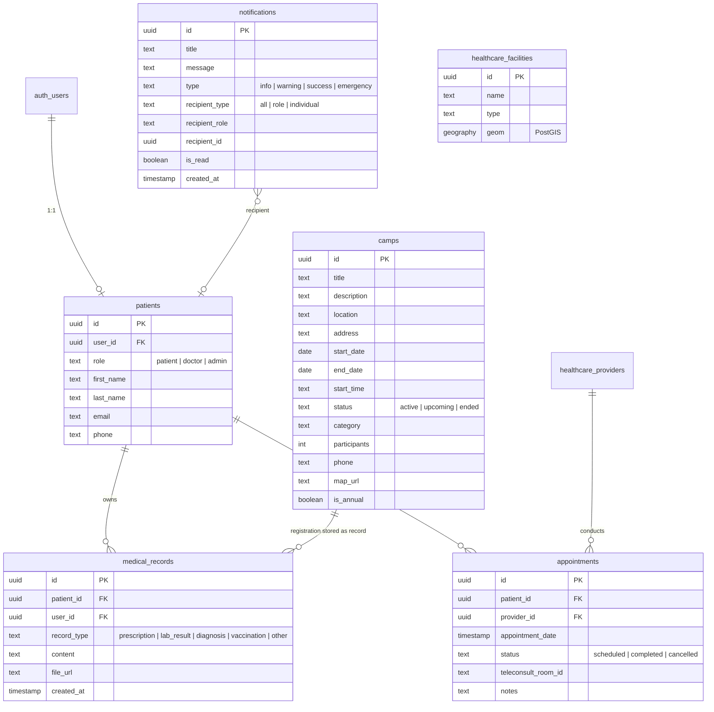

# Project Context: Rural Healthcare Platform

This document is the **master source of truth** for the Rural Healthcare Platform repository. It is maintained as a living document and updated after every major sprint. Last updated: **July 15, 2026**.

---

## 1. Project Overview

### Vision
To democratize healthcare access for rural populations by providing a unified, low-bandwidth digital platform that bridges the physical gap between patients and healthcare providers through AI, telemedicine, and localized data.

### Problem Statement
Rural communities, particularly in regions like Madhya Pradesh, face severe shortages of accessible healthcare facilities and specialized doctors. Patients often lack medical records, travel long distances for basic consultations, and struggle with health literacy. Existing digital solutions fail due to language barriers, complex UI, and offline connectivity issues.

### Target Users
1. **Patients:** Rural residents with basic smartphones, low bandwidth, and primarily Hindi-speaking.
2. **Doctors:** Providers accessing a dedicated portal to manage appointments and patient records.
3. **Admins:** Platform administrators managing users, campaigns, and notifications.

### Live URL
**https://rural-healthcare-platform.vercel.app**

---

## 2. Technology Stack

### Frontend & Core Framework
- **[Next.js 15.2](https://nextjs.org/):** React framework using the App Router. Provides Server Components and API Routes.
- **[React 18.3](https://react.dev/):** UI library.
- **[TypeScript](https://www.typescriptlang.org/):** Strict static typing across the entire codebase.

### Styling & UI Components
- **[Tailwind CSS 3.4](https://tailwindcss.com/):** Utility-first styling.
- **[shadcn/ui](https://ui.shadcn.com/):** Accessible component primitives (Radix UI based).
- **[Lucide React](https://lucide.dev/):** Iconography.

### Backend & Database
- **[Supabase](https://supabase.com/):** PostgreSQL, Auth, Realtime, and Storage.
- **[PostgreSQL + PostGIS](https://postgis.net/):** Relational DB with spatial extensions for facility mapping.
- **[@supabase/ssr](https://supabase.com/docs/guides/auth/server-side/nextjs):** SSR-compatible cookie-based auth.

### Specialized Services
- **[Google Gemini AI](https://deepmind.google/technologies/gemini/):** LLM for AI chat and symptom analysis.
- **[Jitsi Meet](https://jitsi.org/):** Open-source WebRTC video conferencing for teleconsultations.
- **[Leaflet / React-Leaflet](https://react-leaflet.js.org/):** Interactive maps via CartoDB Voyager tiles.
- **[Zod](https://zod.dev/):** Schema validation for all API request bodies.

---

## 3. High-Level Architecture

The platform is a serverless SPA where Next.js is both the BFF and the frontend. Supabase handles persistence, auth, and realtime.


---

## 4. Folder Structure

```text
RURAL-HEALTHCARE-PLATFORM/
├── app/
│   ├── api/
│   │   ├── admin/seed-demo/   # Creates demo accounts (doctor/admin/patient)
│   │   ├── ai-chat/           # Gemini AI streaming chat
│   │   ├── appointments/      # GET/POST/PATCH appointments (role-aware)
│   │   ├── auth/profile/      # Fetch/update patient/provider profile
│   │   ├── facilities/nearby/ # PostGIS spatial facility search
│   │   ├── health-data/       # Vitals tracking
│   │   ├── medical-records/   # Records CRUD
│   │   ├── symptom-analyze/   # Gemini symptom triage
│   │   └── teleconsult/room/  # Jitsi room generation
│   ├── page.tsx               # SPA router (currentPage state)
│   └── globals.css
├── components/
│   ├── ui/                    # shadcn/ui primitives
│   ├── Authentication.tsx     # Login / Register / Google OAuth
│   ├── Header.tsx             # Role-aware top nav + NotificationBell
│   ├── Dashboard.tsx          # Patient dashboard
│   ├── AdminDashboard.tsx     # Admin overview
│   ├── AdminUserManagement.tsx
│   ├── AdminCampaignManager.tsx  # Rich campaign CRUD with map/phone/time
│   ├── AdminNotifications.tsx    # Send notifications to users
│   ├── AdminAppointments.tsx     # All appointments (admin view)
│   ├── AdminRecords.tsx          # All medical records (admin view)
│   ├── DoctorAppointmentRequests.tsx
│   ├── DoctorPatients.tsx        # All patients + medical records
│   ├── NotificationBell.tsx      # Yellow bell with unread badge + realtime
│   ├── AppointmentManager.tsx    # Patient appointments (redirects to consultation)
│   ├── ConsultationPortal.tsx    # Book teleconsultation
│   ├── PatientRecords.tsx        # Patient's own medical records
│   ├── CampLocations.tsx         # Health camps (map + list)
│   ├── MapView.tsx               # Leaflet facility map
│   ├── SymptomChecker.tsx        # AI symptom analysis
│   ├── EmergencyModule.tsx       # First-aid cards
│   └── ...
├── scripts/                   # DB migration SQL files (run in order)
│   ├── 001_create_tables.sql
│   ├── 006_seed_real_data.sql
│   ├── 007_security_hardening.sql
│   ├── 009_fix_audit_trigger.sql
│   ├── 011_notifications_table.sql
│   ├── 012_camps_extra_columns.sql   # Creates camps table from scratch
│   ├── 013_fix_rls_doctor_admin.sql  # Doctor/admin read-all RLS
│   └── 014_fix_patient_self_read.sql # CRITICAL: patient self-read RLS
├── docs/
│   ├── PROJECT_CONTEXT.md     # This file
│   └── ARCHITECTURE.md
└── lib/
    ├── supabase/              # client.ts, server.ts, middleware.ts
    ├── offline/               # IndexedDB sync
    └── rate-limit.ts
```

---

## 5. Role System

The platform has **three roles**, all stored in `patients.role`:

| Role | Email (Demo) | Password | Portal |
|------|-------------|----------|--------|
| `patient` | `patient@ruralhealth.demo` | `Patient@123` | Default patient UI |
| `doctor` | `doctor@ruralhealth.demo` | `Doctor@123` | Teal header, Patients/Requests/Appointments tabs |
| `admin` | `admin@ruralhealth.demo` | `Admin@123` | Purple header, Users/Campaigns/Notify/Appointments tabs |

> There is also `admin@ruralhealth.com` (old seed) and `doctor@ruralhealth.com` — both exist but prefer the `.demo` ones.

Role is determined after login by querying `patients.role` using `auth.uid()`. The `Authentication.tsx` login handler reads this and sets the React user state, which drives the Header and page router.

---

## 6. Feature Inventory

### 6.1 Authentication — ✅ Implemented
- Email/Password, Google OAuth, Guest mode
- Login reads `patients.role` to determine UI portal
- **Files:** `components/Authentication.tsx`, `app/api/auth/profile/route.ts`

### 6.2 SPA Router — ✅ Implemented
- `currentPage` state in `app/page.tsx` drives all navigation
- Role-aware: admin sees purple portal, doctor sees teal portal, patient sees default
- **Files:** `app/page.tsx`

### 6.3 Patient Dashboard — ✅ Implemented
- Stats: consultations count, campaigns registered, health score
- Recent medical records strip
- Registered camps list
- **Files:** `components/Dashboard.tsx`

### 6.4 Admin Dashboard & Portal — ✅ Implemented
- Overview stats: total users, appointments, records
- Quick-action tiles: All Appointments, Medical Records, User Management, Campaigns, Notifications, Health Facilities, Emergency
- **Files:** `components/AdminDashboard.tsx`

#### Admin Sub-Pages
| Page | Route Key | Description |
|------|-----------|-------------|
| User Management | `admin-users` | List all users, approve/remove, filter by role |
| Campaign Manager | `admin-campaigns` | Rich CRUD: title, description, venue, address, date, time, participants, phone, map URL, annual flag |
| Notifications | `admin-notifications` | Compose + send notifications to all/role/individual users |
| All Appointments | `admin-appointments` | See all appointments, filter by status, update status |
| Medical Records | `admin-records` | Browse all users, expand to see their records |

### 6.5 Doctor Portal — ✅ Implemented
- Teal-themed header with: Patients / Requests / Appointments / Hospitals / Emergency tabs
- **Patients page:** Shows ALL patients from DB with expandable medical records (tries `patient_id` then `user_id` fallback)
- **Requests page:** Pending appointment requests with approve/reject
- **Appointments page:** All appointments (doctor sees ALL, not just own)
- **Files:** `components/DoctorPatients.tsx`, `components/DoctorAppointmentRequests.tsx`

### 6.6 Notification System — ✅ Implemented
- `notifications` table in DB (script 011)
- Admin sends via `AdminNotifications.tsx` to: `all` / `role` / `individual`
- `NotificationBell.tsx`: Yellow bell icon in header, unread count badge, realtime subscription, dropdown panel, mark-all-read
- **Files:** `components/NotificationBell.tsx`, `components/AdminNotifications.tsx`, `scripts/011_notifications_table.sql`

### 6.7 Consultation / Appointments — ✅ Implemented
- "Book New Appointment" button in patient's Appointments page now redirects to ConsultationPortal (not old inline form)
- Consultation portal: specialty filters, real MP doctors, 7-day slot picker, Jitsi room generation
- **Files:** `components/ConsultationPortal.tsx`, `components/AppointmentManager.tsx`, `app/api/appointments/route.ts`

### 6.8 Medical Records — ✅ Implemented
- Patient's own records via `PatientRecords.tsx`
- Doctor sees patient records via `DoctorPatients.tsx`
- Admin sees all records via `AdminRecords.tsx`
- Consultation bookings saved as `medical_records` entries (type `other`) as fallback
- **Files:** `components/PatientRecords.tsx`, `app/api/medical-records/route.ts`

### 6.9 Health Camps — ✅ Implemented (DB-connected)
- `camps` table created via `scripts/012_camps_extra_columns.sql`
- Admin creates/edits/deletes via `AdminCampaignManager.tsx`
- Rich fields: venue, address, time, participants, phone, map URL, annual flag, action buttons (Call/Directions/Map)
- Patient view at `CampLocations.tsx`

### 6.10 Facility Map — ✅ Implemented
- CartoDB Voyager tiles (no more grey map)
- PostGIS spatial search via `/api/facilities/nearby`
- Leaflet CSS imported globally in `app/layout.tsx`
- **Files:** `components/MapView.tsx`, `components/CampLocations.tsx`

### 6.11 AI Symptom Checker — ✅ Implemented
- Multi-step wizard → Gemini AI triage
- Voice dictation (Web Speech API)
- Hindi/English translate toggle in chat
- **Files:** `components/SymptomChecker.tsx`, `app/api/symptom-analyze/route.ts`

### 6.12 Offline Support — ⚠️ Partially Implemented
- IndexedDB queuing of POST requests
- Flushed on network reconnect
- Does NOT include full SW caching
- **Files:** `lib/offline/`, `app/api/offline-sync/route.ts`

---

## 7. Database Schema



---

## 8. API Reference

| Endpoint | Method | Auth | Role | Purpose |
|----------|--------|------|------|---------|
| `/api/ai-chat` | POST | Required | Any | Gemini AI chat streaming |
| `/api/symptom-analyze` | POST | Optional | Any | Symptom triage via Gemini |
| `/api/appointments` | GET | Required | Any | Doctor/Admin: ALL; Patient: own only |
| `/api/appointments` | POST | Required | Patient | Book new appointment |
| `/api/appointments` | PATCH | Required | Doctor/Admin | Update appointment status |
| `/api/auth/profile` | GET/PUT | Required | Any | Fetch/update patient profile |
| `/api/facilities/nearby` | GET | Optional | Any | PostGIS facility search |
| `/api/health-data` | GET/POST | Required | Patient | Vitals tracking |
| `/api/medical-records` | GET/POST | Required | Patient | Own records CRUD |
| `/api/teleconsult/room` | POST | Required | Any | Generate Jitsi room |
| `/api/offline-sync` | POST | Required | Any | Flush offline queue |
| `/api/admin/seed-demo` | POST | Secret | — | Create demo accounts |

---

## 9. Row-Level Security (RLS) — Current State

RLS is enabled on all main tables. The current policy set (as of July 15 2026):

### `patients` table
| Policy | Rule |
|--------|------|
| `patients_read_own_row` | User reads own row (`user_id = auth.uid()`) — **CRITICAL for login** |
| `admin_read_all_patients` | Admin reads all rows |
| `doctor_read_all_patients` | Doctor reads all rows |

### `appointments` table
| Policy | Rule |
|--------|------|
| `patients_read_own_appointments` | Patient reads own (+ role check) |
| `doctor_read_all_appointments` | Doctor reads all |
| `admin_read_all_appointments` | Admin reads all |

### `medical_records` table
| Policy | Rule |
|--------|------|
| `patients_read_own_records` | Patient reads own (+ role check) |
| `doctor_read_all_medical_records` | Doctor reads all |
| `admin_read_all_medical_records` | Admin reads all |

### `camps` table
| Policy | Rule |
|--------|------|
| `camps_public_read` | Anyone (anon + auth) can SELECT |
| `camps_admin_insert` | Admin only INSERT |
| `camps_admin_update` | Admin only UPDATE |
| `camps_admin_delete` | Admin only DELETE |

### `notifications` table
- All authenticated users can SELECT (filtered client-side by recipient type/role/id)
- Admin can INSERT/UPDATE/DELETE

> ⚠️ **Critical:** `patients_read_own_row` must always exist. Removing it breaks login for all users because `Authentication.tsx` reads `patients.role` immediately after `signInWithPassword`.

---

## 10. Authentication Flow

1. User submits email/password to `Authentication.tsx`
2. `supabase.auth.signInWithPassword()` returns JWT session
3. App immediately queries `patients` table: `SELECT role, first_name, last_name, phone WHERE user_id = auth.uid()`
4. Role determines which portal is shown (patient/doctor/admin)
5. `Header.tsx` renders role-appropriate navigation tabs
6. `NotificationBell.tsx` subscribes to Supabase Realtime for live notifications

---

## 11. SQL Migration Order

Run these scripts **in order** in Supabase SQL Editor for a fresh setup:

| # | File | Purpose |
|---|------|---------|
| 1 | `001_create_tables.sql` | Core schema |
| 2 | `006_seed_real_data.sql` | 15 MP doctors, 8 hospitals |
| 3 | `007_security_hardening.sql` | Base RLS + indexes |
| 4 | `009_fix_audit_trigger.sql` | NULL-safe audit trigger |
| 5 | `011_notifications_table.sql` | Notifications table + RLS |
| 6 | `012_camps_extra_columns.sql` | Creates camps table from scratch |
| 7 | `013_fix_rls_doctor_admin.sql` | Doctor/Admin read-all RLS |
| 8 | `014_fix_patient_self_read.sql` | **CRITICAL**: patient self-read policy |

Plus these one-off commands:
```sql
ALTER TABLE medical_records ALTER COLUMN provider_id DROP NOT NULL;
UPDATE storage.buckets SET public = TRUE WHERE id = 'medical-records';
```

---

## 12. Demo Accounts

Created via `POST /api/admin/seed-demo` with `{"secret":"ruralhealth-demo-2026"}`:

| Role | Email | Password |
|------|-------|----------|
| Doctor | `doctor@ruralhealth.demo` | `Doctor@123` |
| Admin | `admin@ruralhealth.demo` | `Admin@123` |
| Patient | `patient@ruralhealth.demo` | `Patient@123` |

To reset passwords: Supabase → Authentication → Users → click user → Reset password.

---

## 13. Known Issues & Workarounds

| Issue | Status | Workaround |
|-------|--------|-----------|
| Doctor sees 0 appointments | ✅ Fixed (July 15) | API now role-checks; doctor/admin skip `patient_id` filter |
| Login stuck spinning | ✅ Fixed (July 15) | `patients_read_own_row` RLS policy restored (script 014) |
| Camps table missing | ✅ Fixed (July 15) | Created via script 012 |
| Campaign `participants` TypeScript null error | ✅ Fixed | Type changed to `number \| null` |
| Doctor medical records showing 0 | ✅ Fixed | Tries `patient_id` then `user_id` fallback; doctor RLS allows read-all |
| Notifications not visible to users | ✅ Fixed | NotificationBell component in Header with Realtime subscription |
| Book Appointment showed old inline form | ✅ Fixed | Button now navigates to `consultation` page |
| Map tiles grey/not loading | ✅ Fixed | Switched to CartoDB Voyager tiles |
| SPA unauthorized page access | ✅ Fixed | Role guards added to `app/page.tsx` for admin and doctor routes |
| Header dropdown missing links | ✅ Fixed | Added `admin-appointments` and `admin-records` to admin dropdown |
| Camp Locations hardcoded / Vercel Build | ✅ Fixed | Fetches from `camps` DB table, uses Haversine distance. TS types fixed for Supabase UUIDs. |
| In-memory rate limiting | ⚠️ Known | Doesn't sync across Vercel edge functions |
| SPA router scalability | ⚠️ Known | ~20 views now; consider file-based routing if it grows further |

---

## 14. Technical Debt

- Move to Next.js file-based routing (`app/(dashboard)/...`) for code splitting
- Implement Redis (Upstash) for cross-instance rate limiting
- Centralize API fetching via TanStack Query (caching, deduplication)
- Replace static doctor list in `ConsultationPortal.tsx` with live `healthcare_providers` DB query
- Add full PWA Service Worker caching for true offline support

---

## 15. Environment Variables

```env
NEXT_PUBLIC_SUPABASE_URL=          # Supabase project URL
NEXT_PUBLIC_SUPABASE_ANON_KEY=     # Public anon key
SUPABASE_SERVICE_ROLE_KEY=         # Admin key (server-only)
GEMINI_API_KEY=                    # Google Gemini AI
NEXT_PUBLIC_SITE_URL=              # OAuth redirect base URL
```

---

## 16. Coding Standards

- **TypeScript:** No unchecked `any`. All DB responses must map to interfaces.
- **Security:** All APIs require rate limiting + auth validation.
- **Bilingual:** Every UI string needs both `en` and `hi` values.
- **Mobile-first:** Use `sm:` / `md:` / `lg:` breakpoints throughout.
- **Supabase joins:** `.select("*, table(...)")` returns joined data as `T[]` even for 1:1 — always check `Array.isArray()`.

---

## 17. Change Log

### July 15, 2026 — Portal & Infrastructure Sprint

#### Bug Fixes
- **Login broken for all users** — `patients_read_own_row` RLS policy was accidentally removed by script 013. Restored via script 014.
- **Doctor Appointments showing 0** — `/api/appointments` GET always filtered by `patient_id`. Now role-checks: patients get own, doctors/admins get all.
- **Camps table missing** — `camps` table didn't exist in DB. Created via `scripts/012_camps_extra_columns.sql`.
- **Campaign TypeScript build error** — `participants` typed as `number | undefined` but DB returns `null`. Fixed to `number | null`.
- **Doctor patient records empty** — `DoctorPatients.tsx` now queries all patients directly from `patients` table (not via appointments join). Medical records tried with `patient_id` first, then `user_id` fallback. Null roles are properly checked.
- **Route Guards** — Added role guards in `app/page.tsx` so patients cannot access `admin-*` or `doctor-*` views.
- **Header Dropdowns** — Admin dropdown now includes Appointments and Records; Doctor dropdown includes Appointments and Hospitals.
- **Camp Locations Hardcoded** — `CampLocations.tsx` now fetches dynamic DB entries from `camps`, merges them with static fallback, and uses true GPS Haversine distance for sorting instead of alphabetical sorting. Also fixed TypeScript state error for `registering` (UUID strings).
- **Doctor Appointments Join Array** — Supabase 1:1 joins return arrays. Fixed `.patients?.[0]` unwrap logic in `DoctorAppointmentRequests.tsx`.

#### New Features
- **NotificationBell** (`components/NotificationBell.tsx`) — Yellow bell in header for all logged-in users. Realtime subscription, unread badge, mark-all-read, dropdown panel.
- **Admin Appointments page** (`components/AdminAppointments.tsx`) — Status filter, search, status management.
- **Admin Records page** (`components/AdminRecords.tsx`) — All users, expandable medical records per user.
- **Rich Campaign Manager** — Added: address, start_time, participants, phone, map_url, is_annual. Cards show Call Camp / Get Directions / View on Map action buttons.
- **Appointment redirect** — "Book New Appointment" in patient view now navigates to ConsultationPortal instead of inline form.
- **Admin Dashboard tiles** — Expanded from 4 to 7 quick-action tiles.

### Earlier — June/July 2026 Sprint (see previous entries)
- Doctor/Admin portals created
- Notifications DB table created (script 011)
- Leaflet map fix (CartoDB tiles)
- ConsultationPortal redesign (real MP doctors, 7-day slot picker)
- AI chat with voice dictation and Hindi/English toggle
- Emergency module first-aid redesign
